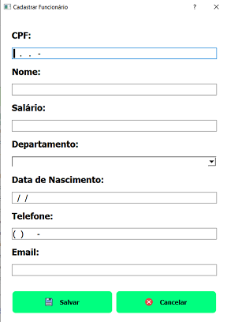
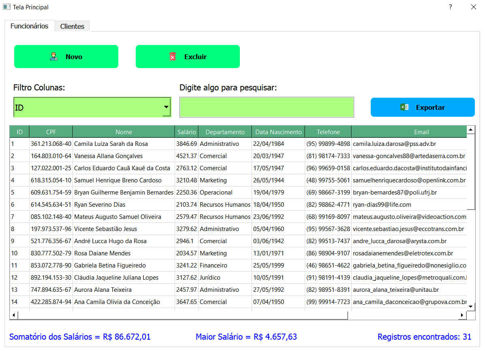

# projeto_EE_2022_1

---

## Projeto Banco de Dados com o QtCreator

Projeto para Avaliação da disciplina Técnicas de Programação_EE_2022.1
Feito na linguagem C++ com a ferramenta QtCreator.

Esse aplicativo pode ser usado para pesquisa, controle, cadastro, exclusão, atualização e geração de um arquivo .csv de funcionários e clientes de um estabelecimento comercial.
Possui as seguintes janelas implementadas:

- Tela de Login
- Tela Principal (composta por duas abas)
  - Funcionários
  - Clientes
- Cadastro Funcionário

  

- Editar Funcionário
- Cadastro Cliente
- Editar Cliente

Foi utilizado o SQL Lite Studio para gerar o banco de dados.

#### _Tela Login_

Há uma tela inicial de login. Como o aplicativo tem conexão com um banco de dados, pode ser cadastrado pessoas com autorização de acesso, obtendo assim um controle maior sobre esses dados.

#### _Tela Principal_

Uma segunda janela é aberta após a autenticação onde, estão presentes duas abas (tabWidget). Uma representa uma base de dados dos funcionários e a outra representa uma base de dados dos clientes.

Em cada aba existem 3 botões, um para gerar o cadastro, outro para excluir um cadastro e um terceiro para gerar o arquivo .csv. Em Filtro Colunas, é possível realizar uma pesquisa filtrando por cada campo presente na tabela apresentada. Pode ser digitado o que se deseja pesquisar no campo: Digite algo para pesquisar. Ambas as tabelas, Funcionários e Clientes, possuem essas funcionalidades.

#### _Aba Funcionários_

Na aba Funcionários, logo abaixo da tabela onde consta o registro dos mesmos, pode ser visualizado os valores: Total dos Salários, Maior Salário e a quantidade de registros encontrados. O Total dos Salários mostra a soma de todos os salários presentes na tabela. Se for efetudo um filtro, esse valor irá atualizar para a nova pesquisa. Já o Maior Salário, irá mostrar o valor do maior salário dos itens que constam na tabela. Esse valor também é atualizado de acordo com a pesquisa. O próximo valor mostrado é Registros encontrados. Nele será visualizado o total de registros da pesquisa. Também é atualizado conforme aumenta ou diminui o número de itens na tabela.

#### _Aba Clientes_

Na aba Clientes há, logo abaixo da tabela, o total de Registros encontrados. Ele tem a mesma funcionalidade descrita na aba Funcionários.

### Exemplo de uso

Embora não seja evidente, serviços de streaming, como a Netflix ou o Prime Video, armazenam as séries e filmes que você assiste e, com o auxílio do machine learning, conseguem sugerir outras coisas baseadas no seu interesse.

Este aplicativo não usa machine learning porém, possui a comodidade de estar integrado à um banco de dados. Vantagem estremamente útil para coletar e armazenar informações selecionadas, como também apresentar uma interface atrativa para o usuário. Logo, permite que os dados sejam interpretados e analisados facilmente. Ou seja, este aplicativo, além de necessário, é extremamente cômodo no que diz respeito ao esforço. Pois, torna-se muito fácil a coleta e a leitura de dados se compararmos com os métodos manuais, como anotações em papel e planilhas, e isso potencializa os negócios.

### Histórico de Atualização

Versão 1.0

##### Link:

[Aluna: Maria da Conceição Z. B. Patrício / Mat.: 20212610013 - repositório no github](https://github.com/MariaZBP/projeto_EE_2022_1)
